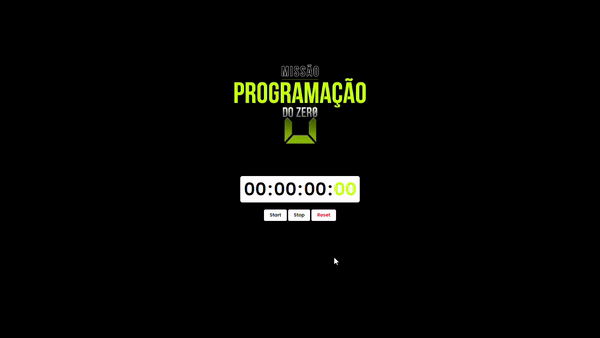

# Cronometro
Cronometro Desenvolvido atraves das aulas Missão Programação do Zero com Rodolfo Mori no Youtube.

O projeto foi criado em:

- [x] HTML
- [x] CSS
- [x] JavaScript

<b>Resultado Hospedado:</b> https://cronometro-g.netlify.app/

## 🤝 Colaboradores

Pessoa que contribuiu para este projeto:

<table>
  <tr>
    <td align="center">
         
        
          <b>Gleysi Ferreira</b>
        
      </a>
    </td>
   </tr>
</table>

